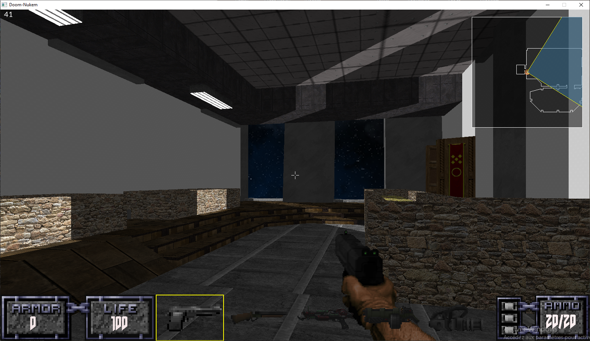

# Doom-Nukem

This is my Doom-Nukem project from 42.

A game engine similar to the original Doom or Duke Nukem 3D games.

## Summary

* [Introduction](#introduction)
* [Technologies](#technologies)
* [Constraints](#contraints)
* [Features](#features)
* [Installation](#installation)
* [How to use](#user%20guide)
* [Authors](#authors)

## Introduction

Following the first two graphical projects from 42 ([FdF](https://github.com/lnicosia/Fdf) and [Fract'ol](https://github.com/lnicosia/fractol)), the students must now recreate the legendary Wolfenstein 3D and Doom video games. But of course, it is more fun if they have to do it with the  same conditions John Carmack and his crew had at the time. This means everything in C and only C, no hardware acceleration and a lot of metal music.

## Technologies

This project was coded in C and used 3 external libraries:

* SDL2 for graphical rendering.
* SDL2_ttf (extension of SDL2) for text rendering.
* FMOD for the sound/music part.

## Constraints

Amongst multiple constraints, here is a non exhaustive list of the restrictions we had to follow:

* C was mandatory

* Drawing only by filling a one-dimension array of pixels
* Computing everything on the CPU (using even 0,001% of the GPU would be flagged as 'cheat') while maintaining a decent framerate, because there was no GPU in 1993
* Using different libraries for the graphical and sound parts
* Compiling and linking the graphical l libraries ourselves
* Of course any crash or memory leak would mean the project has failed

## Features

This project features two applications: doom-nukem and doom-editor.

The first one is the game executable. It allows you to play any map created with the second one, the editor.

You play the Doom guy in a typical 90's FPS game. You will have to find your way through levels filled with obstacles, enemies, and events, in a 3D-imitation environment, such as the Doom or Duke Nukem 3D video games. In our "Doom-Nukem" world, you control, you can look in every direction using the mouse and move with W, A, S, D or the arrow keys. This means you can strafe.

The game engine allows designers to create complex 2D-based architecture with fully textured rooms of any shapes, elevations, slopes, skyboxes..  and of course, music and sounds!

PHOTO ARCHITECTURE

To help you throughout those missions, you will start with a simple handgun but you also find different and stronger weapons, ammos, health or armor packs. They will be scattered in the maps and represented as simple or oriented sprites. Objects may also be decorations with solid hitboxes.

PHOTO OBJETS

The main danger of levels are the enemies, each having its own specific behaviour. For example, you can meet the Doom' Lost Soul. This one flies to you as fast as possible and inflicts damage if it manages to reach you before dying:

PHOTO LOST SOUL QUI ATTAQUE

You can also find Cyberdemons, who shoot rockets at you:

GIF CYBERDEMON QUI TIRE ROQUETTE

Levels can also include architectural obstacles when the designers decide to play with heights differences, creating jumps, platforms, low gravity or even flying rooms

GIF VOL

The game engine also features a complex system of events, allowing map designers to create infinite possibilities of interactions: buttons to press, plates to triggers, moving doors, lifts, teleporters, etc.. 

GIFS D'EVENTS

For more information about events diversity, check their [editor part](#editor)

There will be different ways to succeed a level: reaching a certain location, killing a boss, pressing a button, etc.. once more, let's jump to the editor part to know more about general level rules.

### Editor

The project also provides a complete level editor.

###### 2D-view editing

From a 2D top-view, you can create, edit, modify and remove any shape of a level.

GIF CREATION DE SECTEUR

###### Shape modelling

 The engine being mostly based on the Build engine from Duke Nukem 3D (even though most of our assets are from Doom), no BSP needs to be computed and everything you create/edit is rendered in real time. 

You need to create sectors by connecting vertices that you place pressing the space key. You can then  join sectors together creating portals 

GIF CREATION DE SECTEUR AVEC UN AUTRE PUIS PASSAGE EN 3D

###### Real time editing

You can then modify every property of the sectors: height, slope, textures, lighting, even gravity! All of it in 2D and in real time. Editing is made with biding and direct value editing

GIF MODIFICATION DE HAUTEUR PUIS PENTE PUIS CHANGEMENT DE TEXTURE

GIF EDITION EN ECRIVANT LES VALEURS

###### Assets addition

When your main architecture is built, you can start adding objects and enemies.

GIF AJOUT OBJET/ENNEMI

###### Assets edition

Once more, you can edit almost everything on your sprites: size, health, damage, speed, etc..

GIF MODIFICATION D'OBJET/ENNEMI

###### Wall, floor and ceiling sprites

###### Events

You reached the most complicated but also most interesting part of the editor: the creation of events/interactions.  The editor features a complete event creation interface, allowing you to imagine countless unique actions and animations to upgrade your map's gameplay.

An event is made of two parts: the trigger, and the action. There are many way to trigger your events:

* Walking in a sector
* Walking out of a sector
* Standing in a sector
* Pressing a wall sprite (people usually chose the button sprite..)
* Shooting on a wall sprite
* Killing an enemy
* Having a collision with an enemy
* Having a collision with an object
* Nothing. Yes, you can have events executed all the time (for examples, blinking lights in a dark corridors) with no specific trigger.

To choose your trigger, simply go in the "Event" tab of the wanted trigger and click on "New event"

GIF EVENTS D'UN SECTEUR

The second part of events is the action they will perform. They allow you to modify almost every property of the level, from player's health, enemies' damage, objects' size, to sectors shapes, floors height, ceiling slopes, etc.. with or without animations. You tell what your event will modify by selecting its target:

GIF CHOIX DE LA TARGET

Once your target is set, you can chose how your event will affect it. You do this by going into the "Action" tab of the even panel, and specifying the value you want your target to reach, or giving a value to add (or subtract if you put a negative value) to it. If you choose "Go to", your event will stop when the value is reached, but if you chose "Add", your event will stop when the chosen value is added. 

GIF CHOIX DE L'ACTION

You also need to indicate the speed of the action. If you let '0', the modification will be performed instantly, but you can create an animation by giving a certain speed (in unit/second).

This may seem complicated, but maybe an example will be easier to understand: if I want to make a door opening upwards, I need to create an event affecting the ceiling's height of a sector. Once if chose what will trigger the event, I create a new one by clicking on the "New event" button. I can then choose my target by clicking on "Sector", then "Ceiling" and finally "Height". Now I need to select which sector's ceiling is to be modified. 

GIF CREATION DE PORTE / CREATION D'UN NOUVEAU EVENT ET SELECTION DE LA CIBLE

Once this is done, I can choose how my ceiling's height will change. In our case, I want to see it slowly moving upwards, so I will tell my event to "Add" 10 units at the speed of 5 per second.

GIF CREATION DE PORTE / CHOIX DE L'ACTION 

Let's see the results!

GIF CREATION DE PORTE / TEST DE L'EVENT

As you can see in the "Action" tab, you can also set a delay between the time of the trigger and the start of the event (in milliseconds) and a maximum number of uses (0 = infinite uses).

The last two tabs of the panel are the launch and executing conditions. Even if your event is triggered, you can add restrictions to its launch by creating launch conditions. For example, I could want my door to open **only if** all the enemies of the room are dead, or only if 3 different buttons are pressed, or even **all of those**.  The possibilities are endless. 

As for executing condition, if they also permit to prevent your event from starting if the conditions are not met, they are mainly used to check if your event should still go on while it has already started. For example, I could want my door to stop opening if something happens: if the player gets out of the room, if another moving element is too close, or even if the player's health gets too low? Once again, you can combine all of it between themselves but also with launch conditions.

Creating a condition is simple: you chose a target the same way you did for the events and you chose a value you want to be checked.

GIF CREATION DE CONDITION

###### General

You can now choose the "general" properties of your level by selecting the Ambiance and Fights musics, the starting stats of the player (position, health, speed, armor) and finally decide how you want the player to win by creating an event. Just select "Win" in the "Other" category when creating the event. Since you can trigger an event with many different ways, your ways of winning just as diversified.

GIF CHOIX DE LA MUSIQUE

GIF STATS DU JOUEUR

GIF CREATION EVENT WIN

GIF TEST EVENT WIN

## Installation

## User guide

## Authors

Gabriel Erhard

Lucas Nicosia

Simon Patry